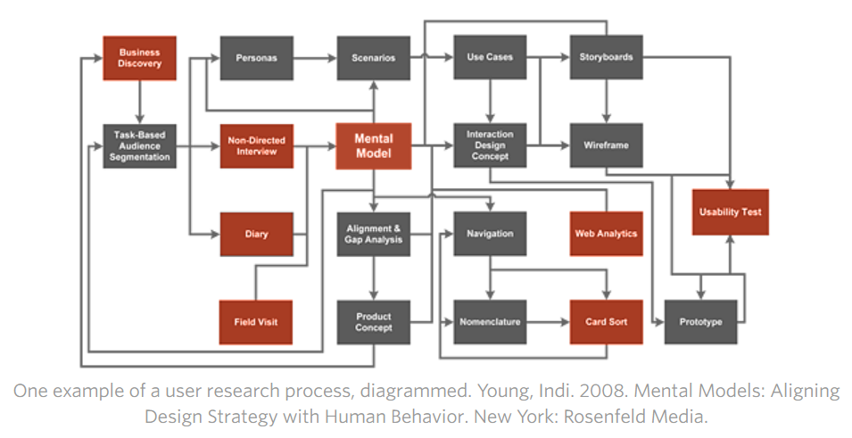

According to https://www.uxbooth.com/articles/complete-beginners-guide-to-design-research/, UX research has two parts: gathering data, and synthesizing that data in order to improve usability. At the start of the project, design research is focused on learning about project requirements from stakeholders, and learning about the needs and goals of the end users. It can be mapped thus:

We can also divide UX research methods into two camps: quantitative and qualitative.

Quantitative research is any research that can be measured numerically. It answers questions such as “how many people clicked here” or “what percentage of users are able to find the call to action?” It’s valuable in understanding statistical likelihoods and what is happening on a site or in an app.
Qualitative research is sometimes called “soft” research. It answers questions like “why didn’t people see the call to action” and “what else did people notice on the page?” and often takes the form of interviews or conversations. Qualitative research helps us understand why people do the things they do.

The approaches we can take are varied; we may use all or some of them, which ever applies to our specific project. They include:

Observation: watch and notice. Look for patterns of behavior within your user group. These patterns will help the design of flexible use cases; they reduce the development effort but also impact UX/UI in that familiarity with the pattern incorporated in the web site will aid the user and enhance their UX.
Understanding: from our point of view, is the development of an accurate mental model. A mental model is the image that someone has in their mind when they think of a particular phrase or situation. For example, if someone owns a condominium, their mental model of “home” will likely differ from the mental model of a house owner. The mental model informs the decisions we make; in the case of the house owners, when asked “how long does it take to do yard work,” their answers will vary based on the size and age of the yard, what kind of yard equipment they own and the nature of the perennials growing in the yard. The condo owner may not have to do any yard work at all, or tend a few plants. Both these rather varied models represent "home."
Analysis: techniques include creating personas or scenarios, describing mental models, and providing charts and graphs that represent statistics and user behaviors. The knowledge gained from the analysis will drive the future decisions regarding design and implementation of the final product. Remember that in UX/UI it is not discovery of what the application must do (that is software engineering) but rather what aesthetics do we consider in our design decisions.
Interviews: basically three types,
Directed interviews: question-and-answer interviews, where a researcher asks specific questions.

Non-directed interviews: conversational approach meant to explore concepts or subjects that are sensitive.

Ethnographic interviews: involve observing what people do as they go about their day accomplishing tasks. It demonstrates how users do things now and may highlight where UX improvements can be made in the new system. This can uncover gaps between what people actually do, and what they say they do.

Questionnaires and surveys: a great research choice for projects that have a large and diverse group of users, or a group that is concerned with anonymity. The downsides are, the researcher can’t interact directly with the respondents, and therefore can’t help with interpreting questions or framing them if the wording isn’t quite correct; researchers typically have a limited ability for follow up. Surveys see a far higher response rate when they do not require a login or contact information, but this anonymity makes it impossible to ask for clarification or further details.
Card sorts: In a card sort, a user is provided with a set of terms, and asked to categorize them. In a closed card sort, the user is also given the category names; in an open card sort the user creates whatever categories he or she feels are most appropriate. The goal of a card sort is to explore relationships between content, and better understand the hierarchies that a user perceives.

Usability testing involves asking potential or current users of a product or service to complete a set of tasks and then observing their behavior to determine the usability of the product or service. This can be done using a live version of a site or app, a prototype or work-in-progress, or even using clickable wire frames or paper and pencil. The three most commonly used:

Moderated usability tests are the most traditional type of test. They can happen in person, or via screen share and video. Whole usability labs are set up, complete with one-way mirrors for stakeholders to observe, for the purpose of conducting moderated usability tests. In a moderated test an unbiased facilitator talks with the user, reading aloud the tasks and prompting the user to think aloud as he or she accomplishes the tasks. The facilitator’s role is to act as a conduit between stakeholders and the user, phrasing questions to evaluate the effectiveness of a design and testing assumptions while helping the user feel comfortable with the process.

Unmoderated usability tests are conducted online, at the user’s convenience. The tasks and instructions are delivered via video or recorded audio, and the user clicks a button to begin the test and record his or her screen and audio. Just like in the moderated test, users are encouraged to speak their thoughts aloud, though there is no facilitator to ask follow up questions.

Guerrilla testing is a modern, lightweight take on traditional tests. Instead of renting a lab, guerrilla research is typically done out in the community; users are found at coffee shops or other public space that is wifi-covered, and asked to complete basic tasks with a website or service, in exchange for a few dollars, a coffee, or just out of the goodness of their hearts. This approach is very effective when there is a large user base. It would not work well if a small target audience is the focus for the application.

A/B testing is another way of learning what actions users take. An A/B test is typically chosen as the appropriate research form when designers must choose between two competing elements. A/B testing requires randomly showing each version to an equal number of users, and then reviewing analytics on which version better accomplished a specific goal. A/B testing is particularly valuable when comparing a revised screen to an older version, or when collecting data to prove an assumption.
