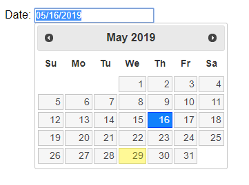
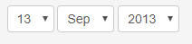
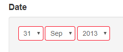
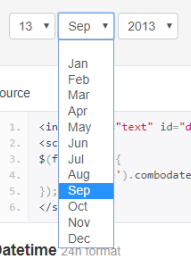
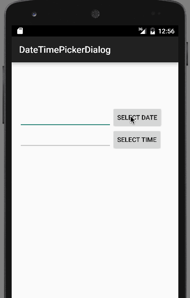

From your interviews and other analysis of the user, you can now build an "ideal user-profile." This profile will list the things we have determined regarding the user and identify those characteristics that will drive the design of the final application. Some questions to consider are:

        What are they attempting to do? This questions focuses on the task or intentions of the user while they interact with the web site. If the user repeats a set of interactions with the interface to accomplish a repeating task, it may be possible to improve the UX by combining the steps into a single step (combine multiple clicks into a single click if possible). Such efficiencies (from the user perspective) will improve the UX.

        When do they do it? Again the linearity of the user tasks should map to how the application progresses through their tasks. For example, in an online retail site, if a user checks the cart contents after every addition to the cart, rather than require the user to click a "show cart" button, display the carts contents in a compressed form, with every addition. The user gets the information they require without having to interact over and over. This leads to better UX.
        How do they currently cope without our product? The answer to this question may help with design of motivation aspects of the site. The benefits of your system over what they do know may be presented on the landing page.

        Why is our solution better than the second-best alternative? This is basically promotional material of comparisons. The factors may include, cost, efficiency, accuracy, usability, trust, security, and many other domain-specific properties.

        Fulfill a user’s need in the simplest possible way; from the interviews and observations, your interface design should incorporate the patterns of behavior and task orientation the user displayed, or described. This should lead to a design that allows the user to accomplish their tasks as efficiently as possible, meaning, with the least amount of data entry, page navigation, button or other clicking, choose, drop-down list selection. For example, if you need a date entered, you could use drop-down lists or a pre-programmed calendar chart. Either will allow for a proper date entry. The knowledge of your user should help you choose which way to go.

Examples of Bad UX when entering a date:

If you use a calendar control similar to this:

there are some features that do not contribute to a great UX:

You can only move backward/forward through months by using the black buttons. There is no way that I can jump to a particular month;
The month/year is display only. If I wanted to jump to a particular date (say June 12, 1953) to find out what day of the week it was, I can not drop down the year to select 1953 or the month to select June, I would need to click the back button 784 times;
A solution might be to use a series of drop-down controls, similar to this:

Problems exist here too:

the first one is already evident. There is no September 31, 2013, so why is 31 even an option - good UX would never provide an invalid option for data entry - it makes no sense!!

super long drop down lists:

                      In the case of this year drop down, finding out the day on which Sept. 30, 1953 occurred still involves sliding the control a large number of years. In the example above, the earliest year is 1970 which would not work for my query at all.

Dates are ubiquitous - you are entering dates everywhere on web pages. Yet most web sites use one of the two approaches shown above. Mobile devices have adopted somewhat more novel approaches to entering date and time. Consider this time picker:

Your task is to choose a set of controls that give the user a good UX.
