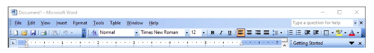
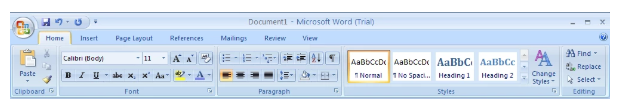
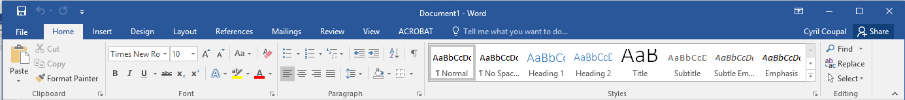
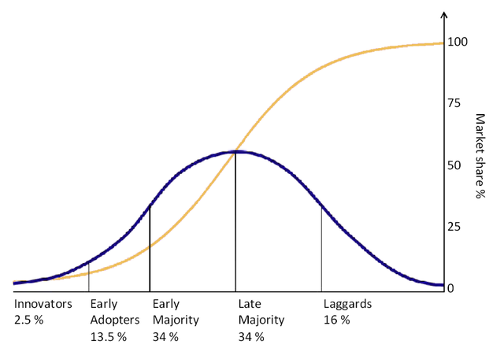

Our expertise can blind us from the knowledge and needs of users, as they may have little to no understanding of what we have created. We have a depth of knowledge regarding what we have created not likely shared by the user. As such, your excitement at what you have created may not be shared, and therefor adopted, quickly by your intended users. For example, a new interface for a routine task or tasks, may not be readily accepted, or even rejected, by users because although the task they wish to perform is familiar, the interface no longer is. They will feel slowed down by the unfamiliarity, having to spend time hunting for things they could find by rote before. Consider the changes in Microsoft Word command menus over time:

2003 ====>

2007 ====>

2016 ====>

As you can see, the changes over time are significant enough that the productivity of a user would be impacted for some time while they learned a new interface for accomplishing the same tasks as before. Ask anyone who has gone through these various manifestations and you will get mixed reviews as to whether the changes helped or hindered their accomplishment of tasks.

New experiences become familiar over time. The more we use a product, the more familiar it becomes. After switching from one of the above Word products to a later version, and suffering through the learning curve to become productive again, the ribbon will become more familiar. Within a period of time, the user will forget the previous layout and work with the new. Our task in UX design is to minimize the amount of time it takes for the user to become familiar with our site.

Early adopters accept risks that later-adopting users may not. The typical adoption curve is similar to this:

The 5 Stages of Technology Adoption | OnDigitalMarketing.com

obtained from https://ondigitalmarketing.com/learn/odm/foundations/5-customer-segments-technology-adoption/. It is evident that to reach 50% of market share will take time. There are many reasons for this, but UX can assist in lessening the time it takes through an appealing, feel-good user experience.

People often resist unfamiliar experiences. Most of us are change-averse. We are wired to resist uncertainty  —  our brains don’t tolerate what they can’t control or anticipate. That’s why we try to fit the unknowns into existing mental models or schemas. Chances are, when dealing with unfamiliar topics, people neither recognize what is typical nor do they desire something different. After all, new experiences are inherently different. When designing experiences, our expertise can blind us to the needs of users, as they may have little to no knowledge of what we have created, while we are excited about the wonderful product we have created. Our desire to innovate outpaces a user’s need to merely catch up, or simply change.

Signifiers, an indicator or signal in the physical or social world that can be interpreted meaningfully, indicate the affordances within an interface (the transactions that are possible between the user and the interface.) Examples of signifiers include buttons (click for some action), drop-down lists (select a pre-canned entry value), and navigation controls (for moving around the site). They can also be colors (red = error or importance, green = acceptable or OK), sounds, or any component of the interface that indicates a potential action the interface will perform for the user.

Innovation is possible and merges into the existing better when the developer considers these concepts and begins from the familiar.
